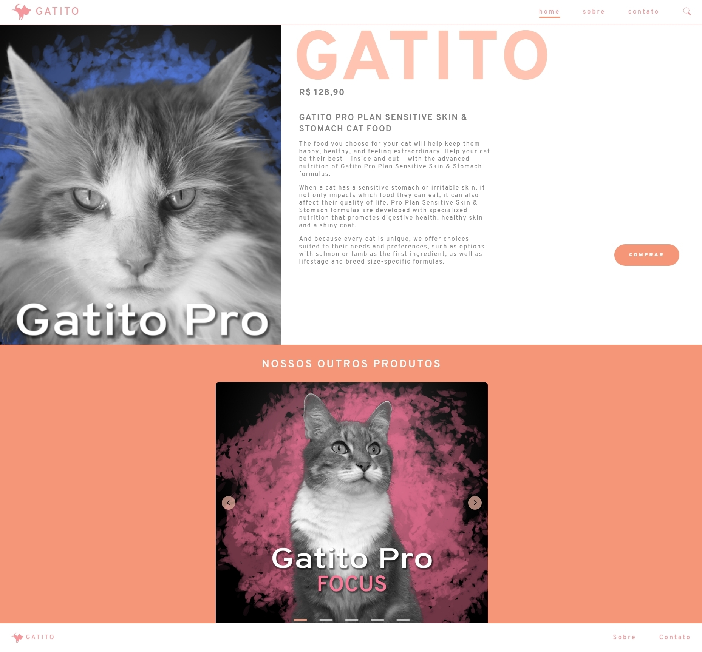

<h1 align="center">
    
</h1>

  :white_check_mark: <a href="https://andreadcsousa.github.io/alura_paralaxe_carrossel/" target="_blank">Veja a página</a>
    &nbsp;&nbsp;&nbsp; | &nbsp;&nbsp;&nbsp;
  :white_check_mark: <a href="https://www.alura.com.br/curso-online-front-end-ui-paralaxe-carrossel" target="_blank">Conheça o curso</a>

# :computer: Projeto
 
- Idealizador: Alura
- Projeto: Formação Front-End
- Lado da força: Front-End
- Tipo: Efeito paralaxe e carrossel
- Etapa: Design/UI do front-end

# :rocket: Tecnologias

# :package: Recursos

### Parallax
- <a href="https://materializecss.com/parallax-demo.html" target="_blank">Parallax</a> é a diferença na posição de objetos vistos em diferentes faixas de visão, medido pelo ângulo de inclinação entre as faixas. Com isso, objetos próximos têm uma maior Parallax que objetos mais distantes, quando observado de posições diferentes.

### Carousel
- <a href="https://materializecss.com/carousel.html" target="_blank">Carousel</a> é um slideshow para fazer um giro em vários coteúdos, construído com CSS 3D transforms e um pouco de JavaScript. Ele funciona com o uso de imagens, texto ou marcação personalizada. Também possui suporte para controles anterior, próximo e indicadores.

# :art: Layout

